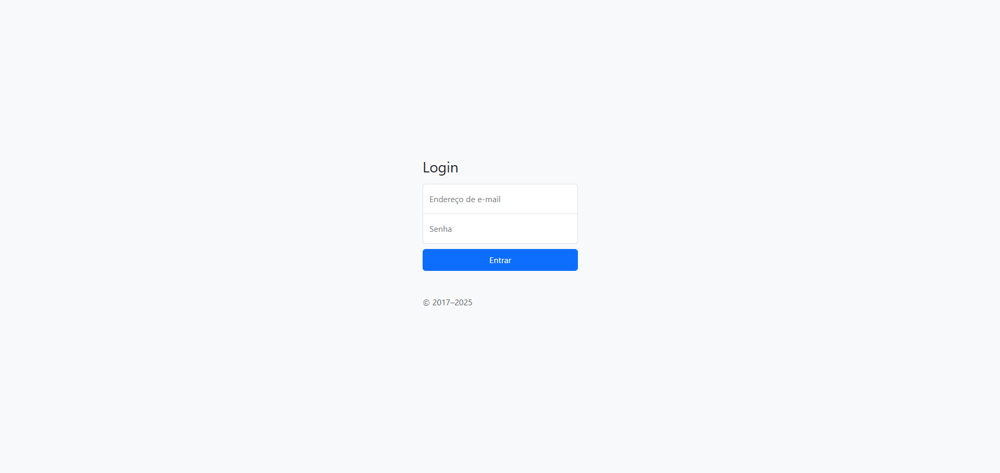
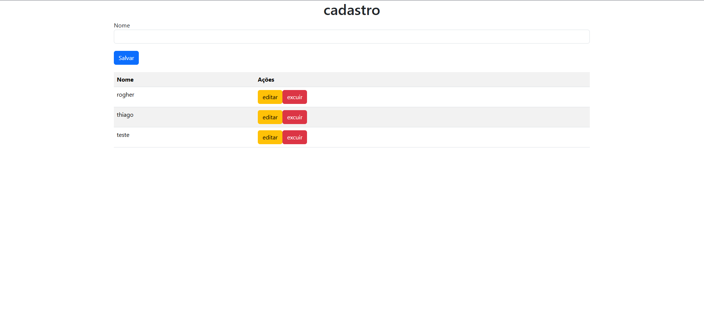

# 💻 Projeto de Cadastro com Login - Bootstrap Básico

Este é um projeto desenvolvido durante as aulas da faculdade 🎓, com o objetivo de aplicar os primeiros conceitos de integração entre **HTML, CSS, JavaScript** e **Bootstrap**. Ele simula um pequeno sistema de **login e cadastro de usuários**, utilizando a biblioteca **Bootstrap 5** como base para estilização.

## ✨ Funcionalidades

- Tela de **Login** com campos de e-mail e senha 🔐
- Redirecionamento para tela de **cadastro** após login com validação
- Cadastro de nomes com:
  - Campo de entrada 📝
  - Botão de salvar ➕
  - Lista de usuários com botões de **editar** ✏️ e **excluir** ❌
- Layout responsivo com **Bootstrap 5.3**

## 🧩 Tecnologias Utilizadas

- HTML5
- CSS3 (incluindo `sign-in.css`)
- JavaScript (puro)
- [Bootstrap 5.3](https://getbootstrap.com/)

## 📌 Observações Importantes

🔰 Este é um **projeto básico** e marca **a primeira vez** que utilizamos um template base do **Bootstrap** para estilização de páginas em sala de aula.  
🔧 Futuramente, pretendemos adicionar melhorias, como:

- Validação mais robusta de dados
- Integração com backend (armazenamento real)
- Layout aprimorado com mais páginas
- Feedback visual com alertas estilizados
- Autenticação mais elaborada




## 📁 Estrutura do Projeto

```
├── index.html # Tela de login 
├── cadastro.html # Tela de cadastro de usuários 
├── main.js # Scripts de login e manipulação de cadastro 
├── sign-in.css # Estilos personalizados para login
```

## 🚀 Como testar

1. Clone ou baixe este repositório
2. Abra o arquivo `index.html` no navegador
3. Preencha os campos e clique em **Entrar**
4. Na próxima tela, cadastre nomes e teste os botões de edição e exclusão

---

> 💡 Este projeto é uma base para aprendizados futuros e será expandido com novos recursos nas próximas aulas!

---
